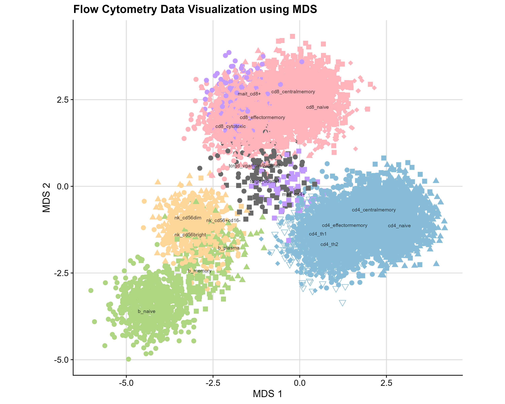

# Dimension Reduction on Flow Cytometry Data

This project explores dimension reduction techniques on a flow cytometry dataset to improve the visualization and classification of cell types. 

## Project Overview

The primary objective is to apply and evaluate different dimensionality reduction techniques on a large dataset of simulated flow cytometry data. These techniques aim to enhance the separation of distinct cell groups and subtypes based on marker expression levels.

### Key Sections

1. **Data Preparation**: Cleaning and preprocessing of flow cytometry data to prepare it for analysis.
2. **Dimensionality Reduction Techniques**:
   - Principal Component Analysis (PCA)
   - Multidimensional Scaling (MDS)
   - UMAP
3. **Evaluation**: Visualizations of cell type separations achieved by each method.

### Images and Plots

Below are some visualizations showcasing the results of the dimension reduction techniques:

#### PCA Visualization

#### MDS Visualization

#### UMAP Visualization

## Getting Started

To view the full analysis, open `DimReduction.html` in a web browser. The file includes all explanations, code and visualizations for the dimensionality reduction techniques applied.

### Requirements

To replicate or extend the analysis, the following R libraries are recommended:
- `ggplot2`
- `uwot`

## Author

- **Yamkela Kwakwi**

